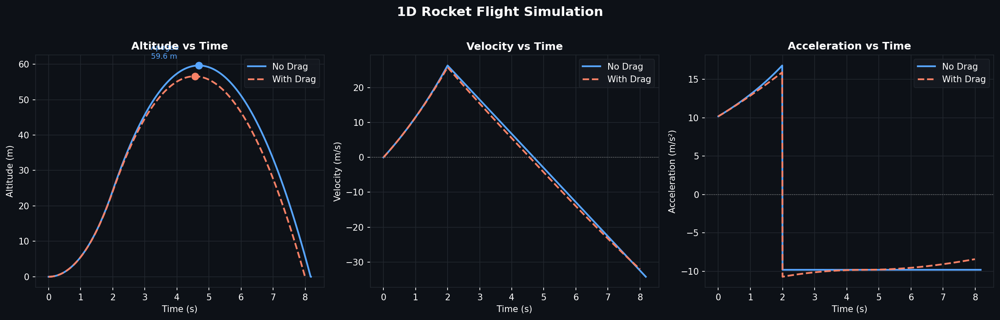

# 1D Rocket Flight Simulator

A physics-based rocket simulation written in Python that models vertical flight using Euler integration. Built as part of my Mechanical Engineering coursework at UCF to apply real propulsion and aerodynamics concepts in code.



## What It Does

The simulator models a rocket from ignition through burnout, apogee, and landing. You can run it with or without aerodynamic drag, and optionally compare both cases side by side on the same plot.

**Key physics modeled:**
- Variable mass during burn (Tsiolkovsky rocket equation principles)
- Constant thrust phase followed by coasting
- Quadratic aerodynamic drag force: `F_drag = -0.5 * ρ * Cd * A * v|v|`
- Euler integration with configurable timestep

**Output includes:**
- Burnout velocity
- Apogee height and time
- Landing time and impact velocity
- Max drag force (when drag is enabled)
- Altitude, velocity, and acceleration plots (saved as `.png`)

## Usage

```bash
python 1D_Constant_Rocket.py
```

You'll be prompted interactively:

```
Include drag? yes or no
> yes

Compare drag with no drag? yes or no
> yes

Show graphs? yes or no
> yes
```

## Sample Output

```
                        Rocket 1 (No Drag)      Rocket 2 (Drag)
Burnout Velocity:       18.34 m/s               18.34 m/s
Apogee Height and Time: 19.68 m @ 3.71 s        18.92 m @ 3.66 s
Landing Time:           9.62 s                  9.49 s
Max Upward Speed:       18.34 m/s               18.34 m/s
Impact Velocity:        -19.62 m/s              -18.86 m/s
Max Drag Force:         0.00 N                  0.22 N
```

## Default Parameters

| Parameter | Value | Description |
|-----------|-------|-------------|
| `mdry` | 1.5 kg | Dry mass |
| `mprop` | 0.5 kg | Propellant mass |
| `tb` | 2.0 s | Burn time |
| `T0` | 40.0 N | Thrust |
| `Cd` | 0.75 | Drag coefficient |
| `D` | 0.075 m | Rocket diameter |
| `dt` | 0.01 s | Integration timestep |

These can all be modified directly in the script.

## Requirements

```
numpy
matplotlib
```

Install with:
```bash
pip install numpy matplotlib
```

## Project Structure

```
1d-rocket-simulation/
├── 1D_Constant_Rocket.py      # Main simulation script
└── simulation_preview.png     # Sample output plots
```

## Background

This was built to reinforce concepts from my Mechanical Engineering degree — specifically propulsion, fluid mechanics, and numerical methods. The drag model uses the standard quadratic drag equation, and the variable mass is handled with a simple linear propellant consumption rate.

---

*Hidekel Irizarry | Mechanical Engineering @ UCF*
